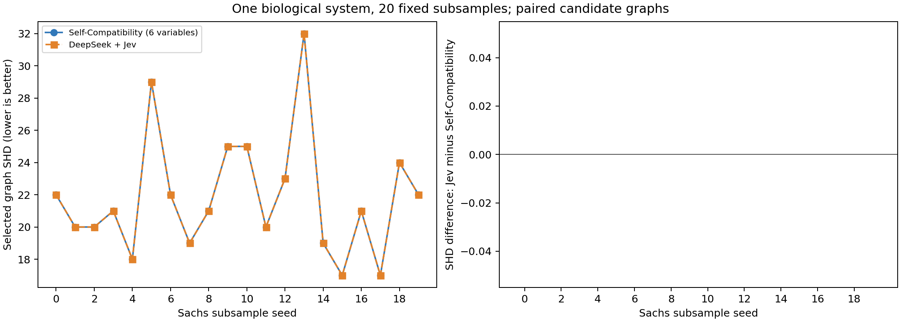

# Sachs：Self-Compatibility 与 LLM＋Jev 对照结果

这是原论文图形不相容评分在 CDFM 上的应用；不是原论文四种发现算法的完整复现。两种方法评价同一对候选图。

## 全量主实验与20次抽样重复

| 范围 | 方法 | 平均 SHD ↓ | 平均 Skeleton F1 ↑ | 严格选优 / 同 SHD / 选差 | 无法区分 |
|---|---|---:|---:|---|---:|
| 全量主实验 | Self-Compatibility（6变量，主口径） | 22.000 | 0.5714 | 1 / 0 / 0 | 0 |
| 全量主实验 | Self-Compatibility（5变量，敏感性） | 22.000 | 0.5714 | 1 / 0 / 0 | 0 |
| 全量主实验 | DeepSeek＋Jev | 22.000 | 0.5714 | 1 / 0 / 0 | 1 |
| 20次重复 | Self-Compatibility（6变量，主口径） | 21.850 | 0.5453 | 19 / 0 / 1 | 0 |
| 20次重复 | Self-Compatibility（5变量，敏感性） | 21.850 | 0.5453 | 19 / 0 / 1 | 0 |
| 20次重复 | DeepSeek＋Jev | 21.850 | 0.5453 | 19 / 0 / 1 | 14 |

20次重复中，Jev 相对主基线胜/平/负：0/20/0；平均 SHD 差（Jev−基线）=0.000，平均 Skeleton F1 差=0.0000。

未达到预先定义的积极信号；不得将本轮描述为全面超过基线。

## 完整逐次结果

| 运行 | 自动/固定 SHD | 主基线选择 | Jev选择 | SHD差 |
|---|---|---|---|---:|
| full | 22/24 | auto | auto | 0 |
| repeat_00 | 22/27 | auto | auto | 0 |
| repeat_01 | 20/24 | auto | auto | 0 |
| repeat_02 | 20/23 | auto | auto | 0 |
| repeat_03 | 21/27 | auto | auto | 0 |
| repeat_04 | 18/24 | auto | auto | 0 |
| repeat_05 | 29/28 | auto | auto | 0 |
| repeat_06 | 22/24 | auto | auto | 0 |
| repeat_07 | 19/26 | auto | auto | 0 |
| repeat_08 | 21/25 | auto | auto | 0 |
| repeat_09 | 25/26 | auto | auto | 0 |
| repeat_10 | 25/31 | auto | auto | 0 |
| repeat_11 | 20/23 | auto | auto | 0 |
| repeat_12 | 23/26 | auto | auto | 0 |
| repeat_13 | 32/38 | auto | auto | 0 |
| repeat_14 | 19/26 | auto | auto | 0 |
| repeat_15 | 17/22 | auto | auto | 0 |
| repeat_16 | 21/26 | auto | auto | 0 |
| repeat_17 | 17/18 | auto | auto | 0 |
| repeat_18 | 24/29 | auto | auto | 0 |
| repeat_19 | 22/26 | auto | auto | 0 |

## 口径与限制

- SHD 按作者 CDT 口径，反向计2；Skeleton F1不看方向。平局及Jev换序不一致均回退自动阈值，并单列无法区分。
- 子集6变量对应论文向上取整，5变量对应作者源码向下取整；两套均预先冻结。
- 21次运行属于同一Sachs系统；20次重复不能当20个独立真实世界任务，不计算跨系统显著性。
- 使用作者修正后的公开参考网络及混合实验条件数据；相对参考网络的误差不等于生物学绝对真值。
- CDFM输出DAG，变量子集可能产生隐藏混杂；κG可能反映这个表达能力限制。作者ADMG以互逆弧表示混杂，不能区分同时存在直接边的情况。
- 没有匿名消融，不能把提升单独归因于变量背景或Jev；熟知公开Sachs网络的可能影响也不能排除。
- 两方法原始数据、候选一致，语义先验和计算预算不同；报告总耗时和API费用。

API尝试次数：43；按峰值单价及用量估算的费用上界 $0.012399；保守预算占用 $0.064964。这不是账户账单实扣金额。

## 复现与来源

[原论文](https://proceedings.mlr.press/v238/faller24a.html) · [作者代码](https://github.com/amazon-science/causal-self-compatibility) · [CDT数据](https://github.com/FenTechSolutions/CausalDiscoveryToolbox/tree/master/cdt/data/resources)

协议见 ../protocol.json；逐次明细见 per_run_results.csv；软件、权重、数据及预测哈希分别见协议和各阶段 freeze 回执。参考网络首次解析在所有预测冻结之后；这是代码阶段隔离，并非操作系统隔离。

## 独立审计与作者实现差异

选图与回退解释：Self-Compatibility 和 Jev 在全部21次运行中最终均选择了自动阈值候选。20次重复中，Jev 有 14/20 次因无法区分或换序不一致而回退默认配置；全量主实验也使用了回退。因此最终指标打平不等于两种判断能力已被证明等价，本轮也未展示相对始终采用自动阈值的额外收益。

验证了 1701 次前向缓存、3402 张无环候选图、3360 个子集距离及42项参考图指标。

CDFM 前向累计耗时：78.54 分钟（各次调用墙钟时间之和，不包含 API、审计和其他开销）。

独立路径定义与作者边际化实现共有 959 次差异。该检查在读取参考网络前登记，原作者实现仍是主结果。

| 范围 | 子集变量数 | 按路径定义复算后改变选择的次数 | Jev−路径基线平均SHD | Jev−路径基线平均F1 |
|---|---:|---:|---:|---:|
| 全量 | 6 | 0 | 0.000 | 0.0000 |
| 全量 | 5 | 0 | 0.000 | 0.0000 |
| 20次重复 | 6 | 0 | 0.000 | 0.0000 |
| 20次重复 | 5 | 0 | 0.000 | 0.0000 |

优势对路径定义核对是否稳健：没有形成同时满足主结果与路径核对的稳健积极信号。

软件修订记录在 protocol_history：001仅修正参考CSV表头读取及首次开启回执；002登记作者边际化可能产生自环的独立诊断。没有修改抽样、候选、提示词、主评分规则或预算。

逐次完整指标：per_run_results.csv；路径诊断：path_definition_diagnostic.csv；原始审计：final_audit.json。
