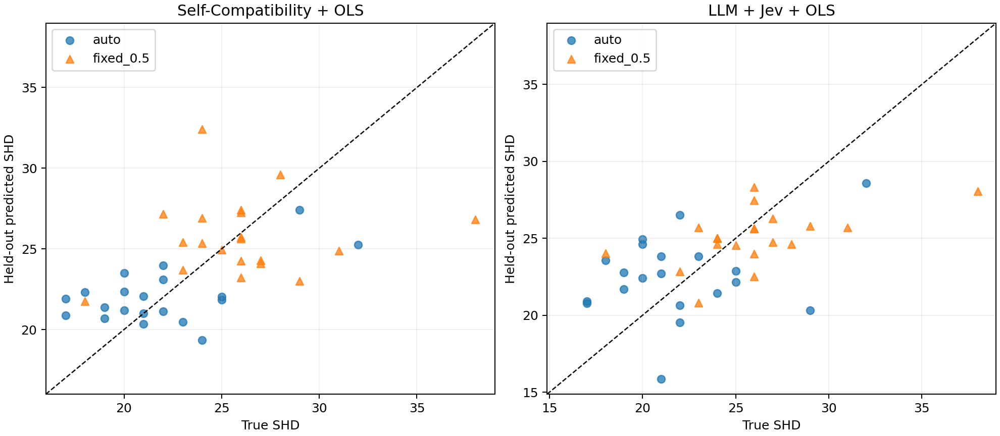
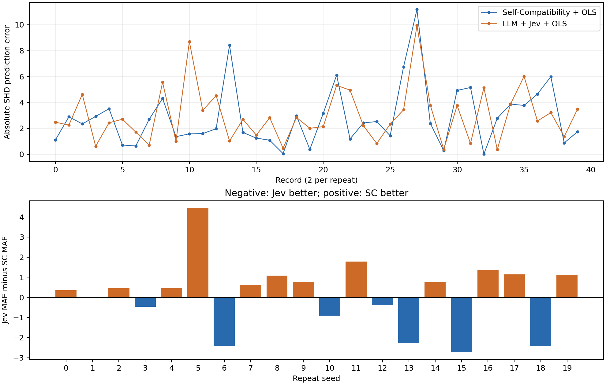

# Sachs SHD 预测实验报告

主评价：**Self-Compatibility＋校准**。Jev MAE 减去 Self-Compatibility MAE 为 **0.133083**；绝对差为 0.133083 个 SHD 单位（相对 Self-Compatibility MAE 的 4.65%）。

这是已有候选图上的事后探索实验；两种原始分数都经过相同形式的一元线性回归校准。未重新调用 CDFM 或 DeepSeek。

## 20 次抽样：40 张图的留组预测

| 方法 | MAE ↓ | RMSE ↓ | 有符号误差 |
|---|---:|---:|---:|
| Self-Compatibility＋校准（主） | 2.863652 | 3.696150 | 0.003811 |
| LLM＋Jev＋校准 | 2.996735 | 3.661513 | -0.119221 |
| Self-Compatibility＋校准（子集5） | 2.356809 | 2.978004 | -0.068070 |
| 训练均值预测 | 3.411842 | 4.443957 | 0.000000 |
| 训练中位数预测 | 3.425000 | 4.425777 | -0.025000 |

以 Jev 相对 Self-Compatibility 主结果计：逐图胜／平／负 **18／0／22**；逐抽样组平均绝对误差胜／平／负 **8／0／12**。

## 按候选类型拆分

| 候选 | Self-Compatibility MAE | Jev MAE | Jev−SC |
|---|---:|---:|---:|
| auto | 2.573920 | 3.508502 | +0.934582 |
| fixed_0.5 | 3.153384 | 2.484969 | -0.668416 |

## 全量数据两张图（单独评价）

| 候选 | 真实 SHD | κG | Jev 原分数 | SC预计SHD | Jev预计SHD | SC绝对误差 | Jev绝对误差 |
|---|---:|---:|---:|---:|---:|---:|---:|
| auto | 22 | 8.8250 | 2.8400 | 21.3727 | 22.3019 | 0.6273 | 0.3019 |
| fixed_0.5 | 24 | 12.9500 | 2.8900 | 25.9640 | 24.1179 | 1.9640 | 0.1179 |

全量两图平均绝对误差：SC **1.295618**，Jev **0.209922**。

## 解释与稳定性

- Self-Compatibility＋校准（主）：MAE 优于训练均值预测、训练中位数预测。
- LLM＋Jev＋校准：MAE 优于训练均值预测、训练中位数预测。
- MAE 与 RMSE 的优劣方向冲突；主结论按冻结的 MAE，同时保留误差分布的权衡。
- 两种候选类型的 MAE 优劣方向不一致或存在平局，优势依赖候选类型。
- 子集5敏感性 MAE：2.356809；不替代子集6主结果。
- Self-Compatibility＋校准（主）校准斜率范围 [0.864927, 1.335494]；负斜率折数 0/20。负斜率如出现，说明校准在反转原始分数方向。
- LLM＋Jev＋校准校准斜率范围 [25.536645, 40.675351]；负斜率折数 0/20。负斜率如出现，说明校准在反转原始分数方向。
- Self-Compatibility＋校准（子集5）校准斜率范围 [1.630855, 2.120331]；负斜率折数 0/20。负斜率如出现，说明校准在反转原始分数方向。
- Jev 原始分数范围 [2.690000, 3.080000]，不同分值数 20；confidence 未作预测值。

## 费用与核验

新增 API 请求尝试 42 次，42 次成功；接口累计耗时 40.95 秒。按返回用量和单价估算的新费用上界 $0.01057333，旧新用量费用上界合计 $0.02297246；旧新保守预算占用 $0.12407689，低于 $2。以上不是账单实付金额。

17 项离线测试通过；独立重算 42 个真实 SHD、126 个回归预测、42 个请求白名单与图哈希。所有复用输入哈希未变。原始响应、协议、评分冻结和交付收据均保存。

## 局限与复跑

这不是 Self-Compatibility 原生输出 SHD 的复现，而是两条路线加相同监督校准后的比较。五级 Jev 标准是本实验固定的设计，不是已验证的因果图误差量表。真实 SHD 使用论文参考网络，反向边计两次；参考网络不是绝对因果真相。

20 次抽样来自同一 Sachs 系统且数据行重叠，真实 SHD 已在旧实验揭晓；这是探索性同系统预测，不是独立新系统测试。不把40张图当独立系统做显著性声明，不声称全面超过。

原作者潜变量边际化的自环行为仍保留在已有 κG 中；前轮诊断曾发现该差异，本轮未改写原始分数。

详见 [逐图结果](per_graph_predictions.csv)、[逐组误差](per_group_errors.csv)、[各折回归系数](fold_models.json)、[独立核验](audit.json) 和上级 README 的复跑步骤。

